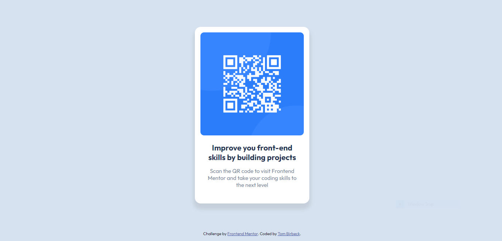

# Frontend Mentor - QR code component solution

This is a solution to the [QR code component challenge on Frontend Mentor](https://www.frontendmentor.io/challenges/qr-code-component-iux_sIO_H). Frontend Mentor challenges help you improve your coding skills by building realistic projects. 

## Table of contents

- [Overview](#overview)
  - [Screenshot](#screenshot)
  - [Links](#links)
- [My process](#my-process)
  - [Built with](#built-with)
  - [What I learned](#what-i-learned)
- [Author](#author)

**Note: Delete this note and update the table of contents based on what sections you keep.**

## Overview

To try to emulate the design in:

### Screenshot

My attempt looks like this:

### Links

- Solution URL: [Add solution URL here](https://your-solution-url.com)
- Live Site URL: [Add live site URL here](https://your-live-site-url.com)

## My process

I started by setting up the body of the document. Giving it a box-sizing of border-box so that the padding an margins wouldn't affect the sizing of elements. I made sure the body itself had no margin or padding, set the height and width to 100% and added the background colour and imported the custom google fonts in the index.html file.
I then created a a div with the class card to be the container for the QR code and text, gave it a height and width and the correct background colour and border radius. I decided to use a display property of flexbox, with a flex direction of column to stack all the elements that would be going inside.
Next, I added an img tag with the src pointing to the QR code image. I sized it to fit the container and added padding to the parent get the placement correct.
I then added a div to hold 2 p-tags, added some padding to the parent and placed the relevant text inside each p-tag. I set the correct font weights and then adjusted the font sizes until I was happy and added the colours to the fonts.
Lastly I added a slight box-shadow and tried to get the placement and colouring as close as I could to the orginal.

### Built with

- Semantic HTML5 markup
- CSS custom properties
- Flexbox

### What I learned

I learned a lot about trying to train your brain to notice the small differences so that I can try to make the end product as close to the design as possible.

## Author

- Website - [Tom Birbeck](https://portfolio-tombirbeck.vercel.app/)
- Frontend Mentor - [@ThomasB](https://www.frontendmentor.io/profile/TomBirbeck)

